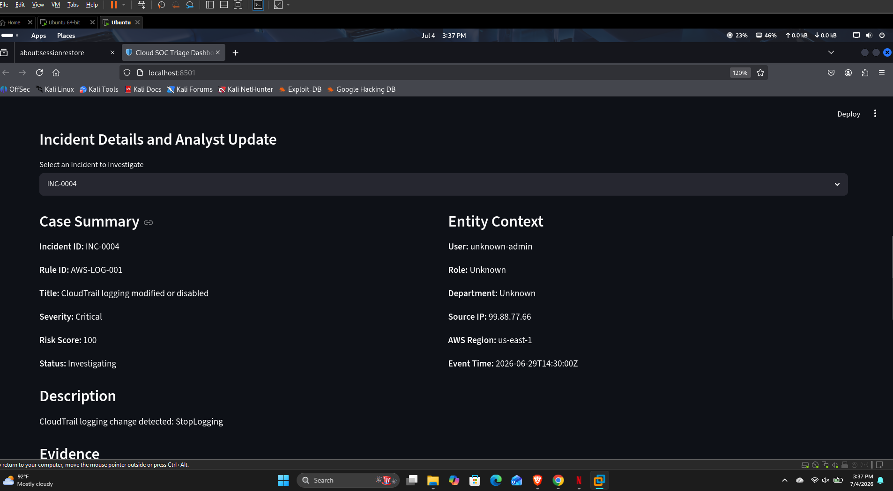

# Python Cloud SOC Triage Engine

## Overview

Python Cloud SOC Triage Engine is an offline cloud security detection, enrichment, correlation, and case management lab.

It analyzes AWS CloudTrail-style logs, detects suspicious cloud activity, maps detections to MITRE ATT&CK, enriches alerts with local user and IP context, stores incidents in SQLite, generates incident reports, and provides a Streamlit dashboard for SOC-style investigation.

This project demonstrates Cloud Security Analyst, Cloud SOC Analyst, SOC Analyst, and junior detection engineering skills without requiring paid AWS infrastructure.

## Dashboard Screenshot

## Architecture

CloudTrail-style logs are processed by a Python parser, detection rules, correlation engine, severity scoring, MITRE mapping, local enrichment, SQLite case database, Streamlit dashboard, and generated incident reports.

## Key Features

- Parses AWS CloudTrail-style JSON logs
- Detects suspicious IAM, root, S3, CloudTrail, and security group activity
- Detects multi-step cloud compromise behavior using correlation logic
- Maps detections to MITRE ATT&CK tactics and techniques
- Adds local enrichment from user and IP context files
- Assigns severity and risk scores
- Stores incidents in a local SQLite case database
- Provides a Streamlit dashboard for SOC triage
- Supports analyst case status updates and notes
- Generates markdown incident reports
- Includes SOC playbooks
- Includes automated pytest coverage
- Supports Docker-based local execution
- Runs fully offline with no cloud cost

## Detection Coverage

| Rule ID | Detection | Severity |
|---|---|---|
| AWS-AUTH-001 | Multiple failed logins followed by success | High |
| AWS-IAM-001 | New IAM access key created | Medium |
| AWS-IAM-002 | Possible IAM privilege escalation | High |
| AWS-LOG-001 | CloudTrail logging modified or disabled | Critical |
| AWS-ROOT-001 | Root account console login detected | Critical |
| AWS-S3-001 | Possible public S3 bucket exposure | High |
| AWS-NET-001 | Security group opened to the internet | High |
| AWS-CORR-001 | Possible cloud account compromise chain | Critical |

## Correlation Detection

The project includes an advanced correlation rule that detects a possible cloud account compromise chain.

Example attack chain:

- Console login activity
- Access key creation
- IAM privilege change
- CloudTrail logging modified

When this sequence is detected within a short time window, the engine creates:

AWS-CORR-001 Possible cloud account compromise chain

This demonstrates detection logic beyond simple single-event matching.

## MITRE ATT&CK Mapping

| Rule ID | MITRE Technique |
|---|---|
| AWS-AUTH-001 | T1110 Brute Force |
| AWS-IAM-001 | T1098 Account Manipulation |
| AWS-IAM-002 | T1098 Account Manipulation |
| AWS-LOG-001 | T1562.008 Disable or Modify Cloud Logs |
| AWS-ROOT-001 | T1078 Valid Accounts |
| AWS-S3-001 | T1530 Data from Cloud Storage |
| AWS-NET-001 | T1578 Modify Cloud Compute Infrastructure |
| AWS-CORR-001 | T1078 / T1098 / T1562.008 |

## Local Enrichment

The engine enriches alerts using local context files:

- data/context/known_ips.csv
- data/context/users.csv

Enrichment fields include IP type, IP label, IP reputation, business-hours context, normal AWS region, unusual region flag, user risk, and local risk notes.

Example:

CloudTrail logging was modified by a critical user from a suspicious IP address.

## Case Management Dashboard

The Streamlit dashboard provides a local SOC case management interface.

Dashboard capabilities include:

- Alert metrics
- Severity filtering
- Status filtering
- User filtering
- IP reputation filtering
- Incident queue
- Incident detail view
- MITRE ATT&CK section
- Local enrichment section
- Evidence view
- Recommended analyst actions
- Case status updates
- Analyst notes

Supported case statuses:

- Open
- Investigating
- Escalated
- Closed
- False Positive

## Incident Reports

The project generates markdown incident reports for each case.

Generated reports are stored in:

reports/generated/

Each report includes executive summary, detection details, entity context, local enrichment, MITRE ATT&CK mapping, evidence, recommended analyst action, analyst notes, case timeline, and closure guidance.

## Project Structure

dashboard/
  app.py

data/
  alerts/
  context/
  incidents/
  raw/

playbooks/
  access_key_created.md
  cloudtrail_tampering.md
  failed_login_success.md
  iam_privilege_escalation.md
  public_s3_exposure.md
  root_account_usage.md
  security_group_open_to_internet.md

reports/
  generated/
  incident_report_template.md

screenshots/
  dashboard.png

src/
  correlation.py
  database.py
  detections.py
  enrichment.py
  incident_queue.py
  local_enrichment.py
  main.py
  mitre_mapping.py
  parser.py
  report_generator.py
  severity.py

tests/
  test_soc_engine.py

## Run Locally

Create and activate a virtual environment:

python3 -m venv venv
source venv/bin/activate

Install dependencies:

pip install -r requirements.txt

Run the SOC engine:

python src/main.py

Generate incident reports:

PYTHONPATH=src python src/report_generator.py

Start the dashboard:

streamlit run dashboard/app.py

Open:

http://localhost:8501

## Run with Docker

Build the Docker image:

sudo docker build -t cloud-soc-triage .

Run the container:

sudo docker run --rm -p 8501:8501 -v "$PWD/data:/app/data" -v "$PWD/reports:/app/reports" cloud-soc-triage

Open:

http://localhost:8501

The Docker container automatically runs the SOC engine, generates reports, and starts the Streamlit dashboard.

## Run Tests

Run the automated test suite:

PYTHONPATH=src pytest -v

Expected result:

9 passed

## SOC Playbooks

The project includes response playbooks for:

- Multiple failed logins followed by success
- New IAM access key creation
- IAM privilege escalation
- CloudTrail logging tampering
- Root account usage
- Public S3 bucket exposure
- Security group opened to the internet

Each playbook includes investigation steps, evidence to review, containment guidance, and closure criteria.

## Skills Demonstrated

- AWS CloudTrail log analysis
- Cloud security monitoring
- IAM threat detection
- Cloud misconfiguration detection
- SOC alert triage
- Detection engineering
- Correlation logic
- MITRE ATT&CK mapping
- Local alert enrichment
- Risk scoring
- SQLite case management
- Streamlit dashboard development
- Incident response documentation
- Python automation
- Pytest validation
- Docker packaging
- Git and GitHub workflow

## Cost Design

This project is intentionally designed to run offline.

No AWS account is required for the main version.

No paid cloud services are required.

The sample CloudTrail-style logs allow the full detection, triage, reporting, and dashboard workflow to run locally.

## Future Improvements

- Optional AWS CloudTrail Event History collector
- Optional S3 CloudTrail log collector
- YAML-based detection rules
- Additional cloud attack-chain detections
- More local enrichment sources
- Export reports as PDF
- Add authentication to the dashboard
- Add Slack or email notification simulation
- Add severity trend charts

## Disclaimer

This project is for educational, portfolio, and lab purposes only. It uses simulated AWS CloudTrail-style telemetry and should not be used as a production security monitoring system without additional validation, hardening, and testing.
